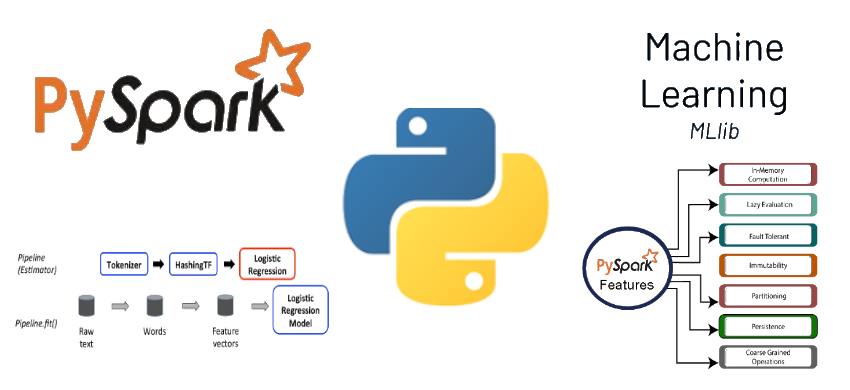

# Python #PySpark #MachineLearning

Credit: Inspired by coursera course: https://www.coursera.org/projects/diabetes-prediction-with-pyspark-mllib. Learn, practice, and apply job-ready skills.

/* The codes are provided "as is" by @araderberg. There are no warranties, expressed or implied, 
as to merchantability or fitness for a particular purpose regarding the materials or code contained herein. 
@araderberg is not responsible for errors in the codes as it now exists or will exist, nor does @araderberg 
provide technical support for it. */
