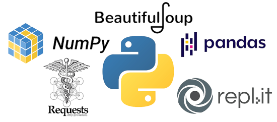

# Python

👋 Hi, I’m @araderberg

👀 I’m interested in collaborating in projects using any clinical research application.

🌱 I’m currently learning APIs using Python, Pandas, Jupiter...

💞️ I’m looking to collaborate on clinical research / data management projects.

📫 How to reach me: datamanagersasprogrammer [at] protonmail [dot] ch

/* The codes are provided "as is" by @araderberg. There are no warranties, expressed or implied, 
as to merchantability or fitness for a particular purpose regarding the materials or code contained herein. 
@araderberg is not responsible for errors in the codes as it now exists or will exist, nor does @araderberg 
provide technical support for it. */
